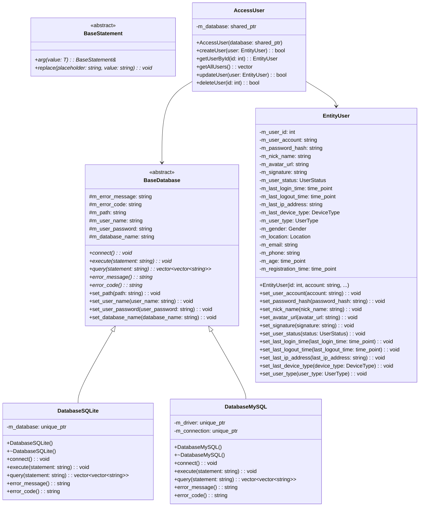
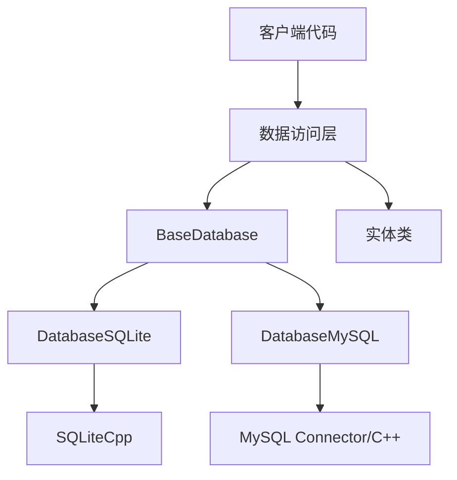
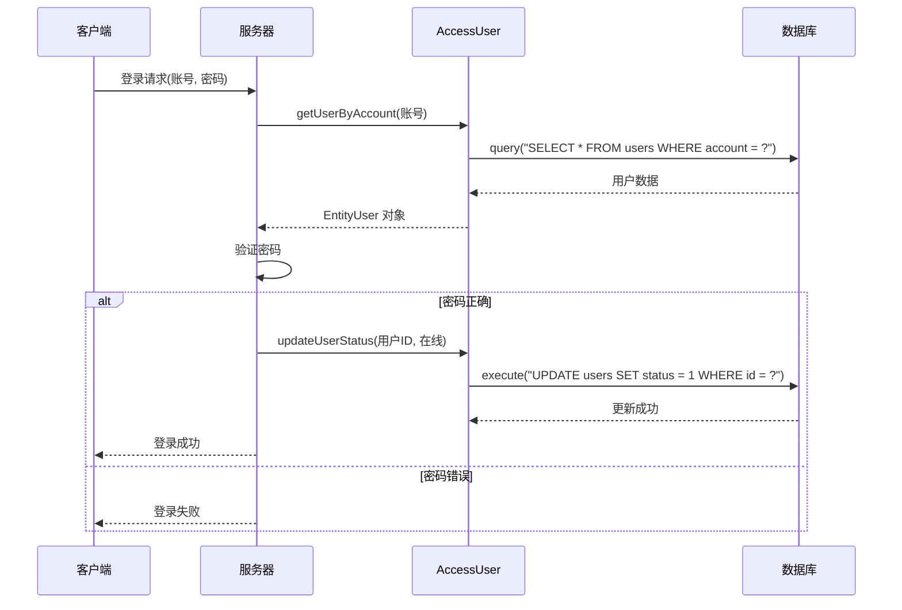
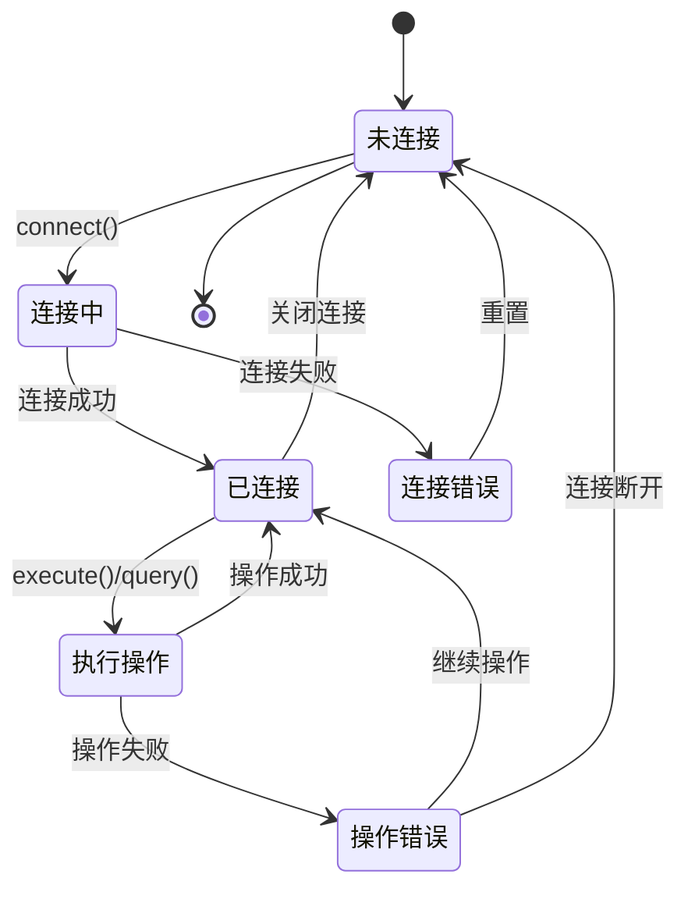

# 数据库模块 UML 类图

## 类图

```mermaid
classDiagram
    class BaseDatabase {
        <<abstract>>
        #m_error_message: string
        #m_error_code: string
        #m_path: string
        #m_user_name: string
        #m_user_password: string
        #m_database_name: string
        +connect(): void*
        +execute(statement: string): void*
        +query(statement: string): vector~vector~string~~*
        +error_message(): string*
        +error_code(): string*
        +set_path(path: string): void
        +set_user_name(user_name: string): void
        +set_user_password(user_password: string): void
        +set_database_name(database_name: string): void
    }
    
    class BaseStatement {
        <<abstract>>
        +arg<T>(value: T): BaseStatement&*
        +replace(placeholder: string, value: string): void*
    }
    
    class DatabaseSQLite {
        -m_database: unique_ptr<SQLite::Database>
        +DatabaseSQLite()
        +~DatabaseSQLite()
        +connect(): void
        +execute(statement: string): void
        +query(statement: string): vector~vector~string~~
        +error_message(): string
        +error_code(): string
    }
    
    class DatabaseMySQL {
        -m_driver: unique_ptr<sql::mysql::MySQL_Driver>
        -m_connection: unique_ptr<sql::Connection>
        +DatabaseMySQL()
        +~DatabaseMySQL()
        +connect(): void
        +execute(statement: string): void
        +query(statement: string): vector~vector~string~~
        +error_message(): string
        +error_code(): string
    }
    
    class EntityUser {
        -m_user_id: int
        -m_user_account: string
        -m_password_hash: string
        -m_nick_name: string
        -m_avatar_url: string
        -m_signature: string
        -m_user_status: UserStatus
        -m_last_login_time: time_point
        -m_last_logout_time: time_point
        -m_last_ip_address: string
        -m_last_device_type: DeviceType
        -m_user_type: UserType
        -m_gender: Gender
        -m_location: Location
        -m_email: string
        -m_phone: string
        -m_age: time_point
        -m_registration_time: time_point
        +EntityUser(id: int, account: string, ...)
        +set_user_account(account: string): void
        +set_password_hash(password_hash: string): void
        +set_nick_name(nick_name: string): void
        +set_avatar_url(avatar_url: string): void
        +set_signature(signature: string): void
        +set_user_status(status: UserStatus): void
        +set_last_login_time(last_login_time: time_point): void
        +set_last_logout_time(last_logout_time: time_point): void
        +set_last_ip_address(last_ip_address: string): void
        +set_last_device_type(device_type: DeviceType): void
        +set_user_type(user_type: UserType): void
    }
    
    class AccessUser {
        -m_database: shared_ptr<BaseDatabase>
        +AccessUser(database: shared_ptr<BaseDatabase>)
        +createUser(user: EntityUser): bool
        +getUserById(id: int): EntityUser
        +getAllUsers(): vector<EntityUser>
        +updateUser(user: EntityUser): bool
        +deleteUser(id: int): bool
    }
    
    BaseDatabase <|-- DatabaseSQLite
    BaseDatabase <|-- DatabaseMySQL
    AccessUser --> BaseDatabase
    AccessUser --> EntityUser
```

## 组件关系

```mermaid
flowchart TB
    Client[客户端代码] --> AccessLayer[数据访问层]
    AccessLayer --> BaseDB[BaseDatabase]
    BaseDB --> SQLite[DatabaseSQLite]
    BaseDB --> MySQL[DatabaseMySQL]
    SQLite --> SQLiteLib[SQLiteCpp]
    MySQL --> MySQLLib[MySQL Connector/C++]
    AccessLayer --> Entities[实体类]
```

## 序列图：用户登录流程

```mermaid
sequenceDiagram
    participant Client as 客户端
    participant Server as 服务器
    participant AccessUser as AccessUser
    participant DB as 数据库
    
    Client->>Server: 登录请求(账号, 密码)
    Server->>AccessUser: getUserByAccount(账号)
    AccessUser->>DB: query("SELECT * FROM users WHERE account = ?")
    DB-->>AccessUser: 用户数据
    AccessUser-->>Server: EntityUser 对象
    Server->>Server: 验证密码
    alt 密码正确
        Server->>AccessUser: updateUserStatus(用户ID, 在线)
        AccessUser->>DB: execute("UPDATE users SET status = 1 WHERE id = ?")
        DB-->>AccessUser: 更新成功
        Server-->>Client: 登录成功
    else 密码错误
        Server-->>Client: 登录失败
    end
```

## 状态图：数据库连接状态

```mermaid
stateDiagram-v2
    [*] --> 未连接
    未连接 --> 连接中: connect()
    连接中 --> 已连接: 连接成功
    连接中 --> 连接错误: 连接失败
    连接错误 --> 未连接: 重置
    已连接 --> 执行操作: execute()/query()
    执行操作 --> 已连接: 操作成功
    执行操作 --> 操作错误: 操作失败
    操作错误 --> 已连接: 继续操作
    操作错误 --> 未连接: 连接断开
    已连接 --> 未连接: 关闭连接
    未连接 --> [*]
``` 